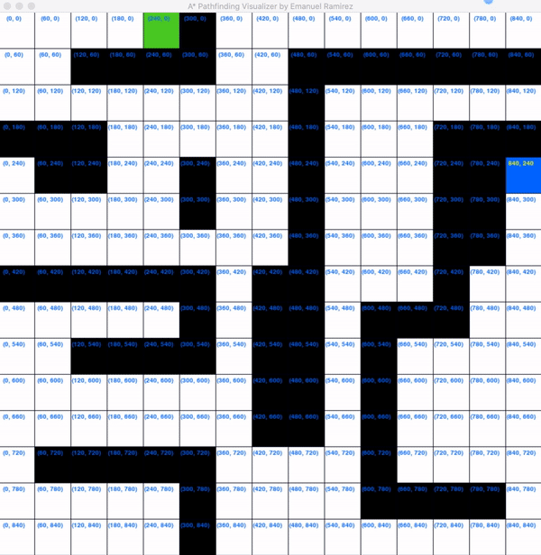
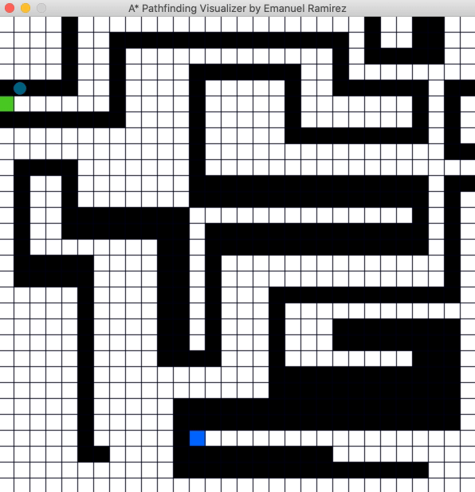

# A* Pathfinding visualizer
The idea of this project is for it to be a interesting new way to teach myself more advanced algorithms.Starting with A* pathfinding algorithm.


## Installation

Clone this repo

```bash
git clone https://github.com/emanuel2718/AstarPathfinding
cd AstarPathfinding
```

Install requirements

```bash
pip install -r requirements.txt
```

## Preview



&nbsp;
&nbsp;




## How to use
Run the visualizer:
```bash
python main.py
```
### Command line argument options:

Diagonal movement during the A* star algorithm
```bash
python main.py -d
```

&nbsp;
### Keybindings:

- `s` : Add starting node (hover over desired square and press the key)

- `e` : Add ending node (hover over desired square and press the key)

- `c` : Toogle on/off the coordinate system on the grid

- click or drag: Add walls (obstacles)

