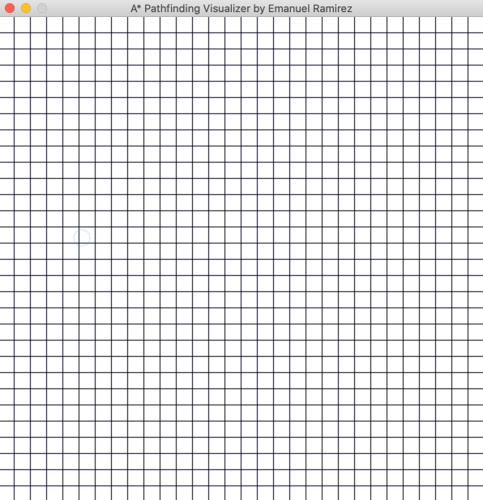
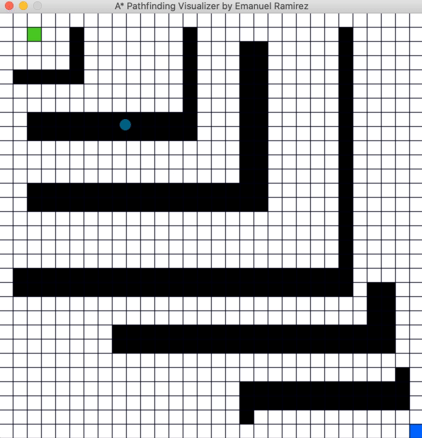

# A* Pathfinding visualizer
The idea of this project is for it to be a interesting new way to teach myself more advanced algorithms.Starting with A* pathfinding algorithm.


## Installation

Clone this repo

```bash
git clone https://github.com/emanuel2718/AstarPathfinding
cd AstarPathfinding
```

Install requirements

```bash
pip install -r requirements.txt
```

## Preview

- Draw unique walls combinations and start the visualization


- Random case 1


- Random case 2



## How to use
```bash
python main.py
```

##### Add starting node
- `s`  key and hover over desired square

##### Add ending node
- `e`  key and hover over desired square

##### Add walls (obstacles)
- Click or drag over desired squares
